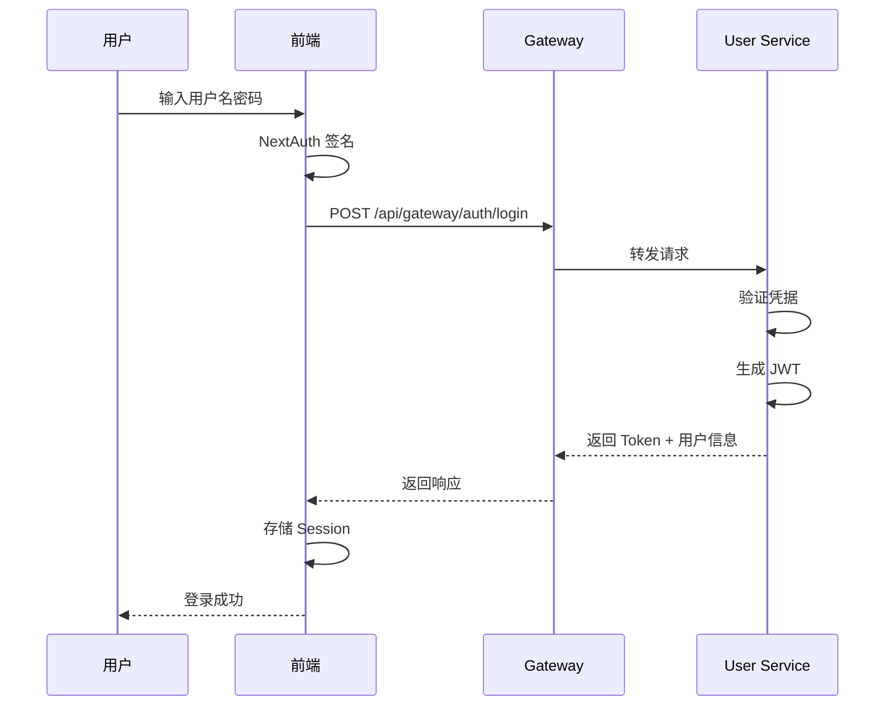
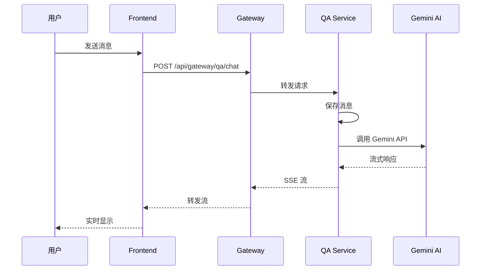

# AI QA System - 项目架构文档

## 一、项目概述

这是一个基于微服务架构的智能问答系统，采用前后端分离设计，支持多用户并发访问，提供 AI 驱动的问答服务。

### 核心特性
- 🔐 基于 JWT 的用户认证系统
- 🤖 集成 Google Gemini AI 模型
- 💬 多会话管理和历史记录
- 📝 实时流式响应
- 🐳 Docker 容器化部署
- 🔄 Spring Cloud 微服务架构

## 二、技术架构

### 2.1 整体架构图

```
┌─────────────────────────────────────────────────────────────────┐
│                         客户端层                                │
│  ┌─────────────────┐  ┌─────────────────┐                      │
│  │   Web 浏览器    │  │   移动端(未来)   │                      │
│  └─────────────────┘  └─────────────────┘                      │
└─────────────────────────────────────────────────────────────────┘
                            │ HTTPS/HTTP
                            ▼
┌─────────────────────────────────────────────────────────────────┐
│                     前端服务层                                  │
│  ┌─────────────────────────────────────────────────────┐       │
│  │   Next.js 应用 (端口: 3000)                         │       │
│  │   ├─ React 19 + TypeScript                        │       │
│  │   ├─ NextAuth.js v5 (认证)                         │       │
│  │   ├─ Tailwind CSS (样式)                           │       │
│  │   └─ Axios (HTTP 客户端)                           │       │
│  └─────────────────────────────────────────────────────┘       │
└─────────────────────────────────────────────────────────────────┘
                            │ HTTP
                            ▼
┌─────────────────────────────────────────────────────────────────┐
│                    API 网关层                                    │
│  ┌─────────────────────────────────────────────────────┐       │
│  │   Spring Cloud Gateway (端口: 8083)                │       │
│  │   ├─ 路由转发与负载均衡                             │       │
│  │   ├─ 认证与授权                                    │       │
│  │   ├─ 限流与熔断                                    │       │
│  │   └─ Swagger API 文档                              │       │
│  └─────────────────────────────────────────────────────┘       │
└─────────────────────────────────────────────────────────────────┘
                            │ 内部服务调用
                            ▼
┌─────────────────────────────────────────────────────────────────┐
│                    微服务层                                      │
│  ┌──────────────────┐  ┌──────────────────┐                     │
│  │  用户服务        │  │   QA 服务         │                     │
│  │  (端口: 8081)    │  │  (端口: 8082)    │                     │
│  │  ├─ 用户注册/登录 │  │  ├─ AI 对话处理   │                     │
│  │  ├─ JWT 管理      │  │  ├─ 会话管理      │                     │
│  │  └─ 用户信息管理   │  │  └─ Gemini AI 集成│                     │
│  └──────────────────┘  └──────────────────┘                     │
└─────────────────────────────────────────────────────────────────┘
                            │ JDBC
                            ▼
┌─────────────────────────────────────────────────────────────────┐
│                    数据存储层                                    │
│  ┌──────────────────┐  ┌──────────────────┐                     │
│  │   MySQL 8.0      │  │   Nacos Server   │                     │
│  │  (端口: 3306)    │  │  (端口: 8848)    │                     │
│  │  ├─ 用户数据      │  │  ├─ 服务注册发现  │                     │
│  │  ├─ 会话数据      │  │  ├─ 配置管理      │                     │
│  │  └─ 聊天历史      │  │  └─ 动态配置      │                     │
│  └──────────────────┘  └──────────────────┘                     │
└─────────────────────────────────────────────────────────────────┘
```

### 2.2 技术栈详情

#### 前端技术栈
```typescript
{
  "框架": "Next.js 15.3.0 (App Router)",
  "UI库": "React 19.0.0-rc + TypeScript 5.9.3",
  "样式": "Tailwind CSS 4.1.13",
  "认证": "NextAuth.js v5.0.0-beta.25",
  "状态管理": "React Hooks + SWR",
  "HTTP客户端": "Axios 1.7.7",
  "构建工具": "Turbo + pnpm 9.12.3"
}
```

#### 后端技术栈
```yaml
框架:
  - Spring Boot 3.1.11
  - Spring Cloud 2022.0.5
  - Spring Cloud Alibaba 2022.0.0.0
  - Spring Security 6.x
  - Spring Data JPA

数据库:
  - MySQL 8.0
  - HikariCP 连接池

服务治理:
  - Nacos (注册发现+配置中心)
  - Spring Cloud Gateway
  - LoadBalancer

AI集成:
  - Google Gemini AI
  - Streaming SSE 响应

其他:
  - Java 17
  - Maven 3.x
  - MapStruct 1.5.5
  - Lombok 1.18.32
```

## 三、服务详细设计

### 3.1 API Gateway (api-gateway)

**职责**：
- 统一入口点，处理所有外部请求
- 路由转发到相应的微服务
- 认证授权（JWT 验证）
- 限流控制和熔断保护
- API 文档聚合

**路由配置**：
```yaml
routes:
  - id: user_service
    uri: lb://user-service-fyb
    predicates:
      - Path=/api/gateway/user/**
    filters:
      - StripPrefix=2

  - id: qa_service
    uri: lb://qa-service-fyb
    predicates:
      - Path=/api/gateway/qa/**
    filters:
      - StripPrefix=2
```

**关键端点**：
- Swagger UI: `http://localhost:8083/swagger-ui.html`
- Health Check: `http://localhost:8083/actuator/health`

### 3.2 User Service (user-service)

**职责**：
- 用户注册和登录
- JWT Token 生成和验证
- 用户信息管理
- 会话管理

**数据库表**：
```sql
- users: 用户基本信息
- user_sessions: 用户会话
- chat_sessions: 聊天会话
```

**API 端点**：
- `POST /auth/login` - 用户登录
- `POST /auth/register` - 用户注册
- `GET /users/{id}` - 获取用户信息
- `POST /users/{id}/sessions` - 创建会话

### 3.3 QA Service (qa-service)

**职责**：
- 处理 AI 问答请求
- 管理聊天历史
- 集成 Gemini AI API
- 流式响应处理

**核心功能**：
```java
@Service
public class QAService {
  // 调用 Gemini AI
  // 处理流式响应
  // 保存聊天历史
  // 管理会话上下文
}
```

**API 端点**：
- `POST /chat` - 发送消息
- `GET /chat/{sessionId}/history` - 获取历史
- `GET /chat/{sessionId}/stream` - 流式响应

### 3.4 Frontend (ai-chatbot)

**目录结构**：
```
ai-chatbot/
├── app/
│   ├── (auth)/           # 认证路由组
│   │   ├── auth.ts      # NextAuth 配置
│   │   ├── login/       # 登录页面
│   │   └── register/    # 注册页面
│   ├── (chat)/           # 聊天路由组
│   │   ├── page.tsx     # 聊天主页
│   │   ├── chat/[id]/   # 聊天会话页
│   │   └── api/         # API 路由
│   └── layout.tsx       # 根布局
├── components/          # React 组件
├── lib/                # 工具库
└── public/             # 静态资源
```

**关键组件**：
- `Chat.tsx` - 聊天界面主组件
- `Message.tsx` - 消息组件
- `Sidebar.tsx` - 侧边栏会话列表
- `AuthForm.tsx` - 认证表单

## 四、数据流设计

### 4.1 认证流程



### 4.2 聊天流程



### 4.3 数据存储

**MySQL 数据库设计**：
```sql
-- 用户表
CREATE TABLE users (
    id BIGINT PRIMARY KEY AUTO_INCREMENT,
    username VARCHAR(50) UNIQUE NOT NULL,
    email VARCHAR(100) UNIQUE NOT NULL,
    password_hash VARCHAR(255) NOT NULL,
    nickname VARCHAR(100),
    role VARCHAR(20) DEFAULT 'USER',
    created_at TIMESTAMP DEFAULT CURRENT_TIMESTAMP,
    updated_at TIMESTAMP DEFAULT CURRENT_TIMESTAMP ON UPDATE CURRENT_TIMESTAMP
);

-- 聊天会话表
CREATE TABLE chat_sessions (
    id BIGINT PRIMARY KEY AUTO_INCREMENT,
    user_id BIGINT NOT NULL,
    title VARCHAR(255),
    visibility_type VARCHAR(20) DEFAULT 'private',
    created_at TIMESTAMP DEFAULT CURRENT_TIMESTAMP,
    updated_at TIMESTAMP DEFAULT CURRENT_TIMESTAMP ON UPDATE CURRENT_TIMESTAMP,
    FOREIGN KEY (user_id) REFERENCES users(id)
);

-- 聊天消息表
CREATE TABLE chat_messages (
    id BIGINT PRIMARY KEY AUTO_INCREMENT,
    session_id BIGINT NOT NULL,
    role VARCHAR(20) NOT NULL, -- 'user' or 'assistant'
    content TEXT NOT NULL,
    created_at TIMESTAMP DEFAULT CURRENT_TIMESTAMP,
    FOREIGN KEY (session_id) REFERENCES chat_sessions(id)
);
```

## 五、部署架构

### 5.1 开发环境

使用 Docker Compose 一键启动所有服务：

```bash
# 启动所有服务
docker compose up -d

# 查看服务状态
docker compose ps

# 查看日志
docker compose logs -f [service-name]
```

**服务地址**：
- 前端: http://localhost:3000
- API Gateway: http://localhost:8083
- User Service: http://localhost:8081
- QA Service: http://localhost:8082
- MySQL: localhost:3306
- Nacos: http://localhost:8848/nacos

### 5.2 生产环境

**部署架构**：
- EC2 实例 (Amazon Linux)
- Docker 容器化部署
- Nginx 反向代理（可选）
- GitHub Actions CI/CD

**网络配置**：
- Docker 网络: `ai-qa-net`
- 服务间通过容器名通信
- 暴露端口：3000(前端)、8083(Gateway)、3306(MySQL)

### 5.3 CI/CD 流程

```yaml
触发条件:
  - Push 到 main 分支
  - Pull Request 到 main

流程:
  1. 构建后端服务 (Maven)
  2. 构建 Docker 镜像
  3. 推送到 Docker Hub
  4. SSH 到 EC2 服务器
  5. 拉取最新镜像
  6. Docker Compose 部署
  7. 健康检查
```

## 六、安全设计

### 6.1 认证机制
- JWT Token 认证
- Token 有效期：12小时
- 密码加密：bcrypt

### 6.2 网络安全
- HTTPS 强制加密（生产环境）
- API Gateway 统一入口
- 内部服务隔离
- CORS 配置

### 6.3 数据安全
- 敏感配置加密存储
- SQL 注入防护
- XSS 攻击防护
- CSRF Token 保护

## 七、监控与运维

### 7.1 日志管理
- Spring Boot Actuator
- 结构化日志输出
- 日志级别动态调整

### 7.2 性能监控
- JVM 监控
- 数据库连接池监控
- API 响应时间监控

### 7.3 健康检查
```bash
# 服务健康检查
curl http://localhost:8083/actuator/health
curl http://localhost:8081/actuator/health
curl http://localhost:8082/actuator/health
```

## 八、扩展性设计

### 8.1 水平扩展
- 微服务独立扩展
- 数据库读写分离
- Redis 缓存层（可添加）
- 消息队列（可添加）

### 8.2 功能扩展
- 多租户支持
- 文件上传功能
- 更多 AI 模型集成
- 插件系统

## 九、最佳实践

### 9.1 开发规范
- 代码 Review 机制
- 单元测试覆盖
- API 文档同步更新
- Git 提交规范

### 9.2 部署规范
- 蓝绿部署
- 滚动更新
- 健康检查
- 回滚机制

### 9.3 性能优化
- 数据库索引优化
- 查询优化
- 缓存策略
- CDN 加速

## 十、故障排查

### 10.1 常见问题

1. **服务无法启动**
   - 检查端口占用
   - 查看容器日志
   - 验证环境变量

2. **认证失败**
   - 检查 JWT_SECRET 配置
   - 验证 Token 过期时间
   - 查看时钟同步

3. **AI 响应慢**
   - 检查 Gemini API Key
   - 查看网络延迟
   - 监控 API 调用频率

### 10.2 调试命令

```bash
# 查看容器状态
docker ps -a

# 查看服务日志
docker compose logs -f api-gateway
docker compose logs -f user-service
docker compose logs -f qa-service

# 进入容器调试
docker exec -it <container-name> bash

# 测试 API 连通性
curl -X POST http://localhost:8083/api/gateway/auth/login \
  -H "Content-Type: application/json" \
  -d '{"username":"demo","password":"password"}'
```

---

## 更新日志

- **2025-01-15**: 初始架构文档
- **2025-01-16**: 更新环境变量配置，移除 Playwright
- **2025-01-16**: 统一使用 NEXT_PUBLIC_GATEWAY_URL

## 联系信息

- 项目仓库：https://github.com/<your-org>/ai-qa-system
- 问题反馈：通过 GitHub Issues
- 文档更新：请提交 PR