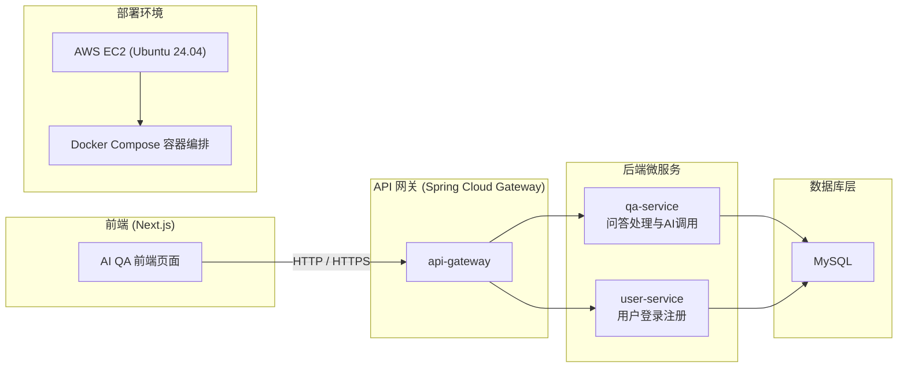

# AI QA System — 智能问答系统

## 项目简介

**AI QA System** 是一个基于微服务架构的智能问答平台，提供从前端交互到后端问答、用户管理、网关聚合的完整解决方案。  
项目采用 **Spring Boot + React + Docker + GitHub Actions + AWS EC2** 构建，  
实现了自动化构建、镜像推送和一键部署。

---

## 系统架构图



## 项目结构

```
ai-qa-system/
├── backend-services/         # 后端微服务
│   ├── api-gateway/          # API 网关（Spring Cloud Gateway）
│   ├── user-service/         # 用户服务（用户注册/登录）
│   ├── qa-service/           # 问答服务（核心逻辑）
│   └── pom.xml
│
├── frontend-nextjs/          # 前端项目
│   └── frontend/             # Next.js 应用
│       ├── Dockerfile
│       ├── .env.production
│       ├── package.json
│       └── ...
│
├── docker-compose.yml        # 整体容器编排配置
└── .github/
    └── workflows/            # CI/CD 流程定义
        ├── ci.yml
        
```
## 技术栈

| 层级   | 技术                                         |
| ---- | ------------------------------------------ |
| 前端   | Next.js 15, TypeScript, Tailwind CSS       |
| 后端   | Spring Boot 3, Spring Cloud Gateway, Maven |
| 数据库  | MySQL                        |
| 容器化  | Docker, Docker Compose                     |
| 持续集成 | GitHub Actions                             |
| 部署平台 | AWS EC2 (Ubuntu 24.04 LTS)                 |

## 快速开始(本地开发模式)

### 克隆项目
git clone https://github.com/zjiayan/ai-qa-system.git
cd ai-qa-system

### 启动后端：
cd backend-services
mvn spring-boot:run

### 启动前端
cd frontend-nextjs/frontend
npm install
npm run dev

访问 http://localhost:3000

## 自动化 CI/CD
### 本项目使用 GitHub Actions 实现自动化构建与部署。
| 文件                                    | 功能              |
| ------------------------------------- | --------------- |
| `.github/workflows/ci.yml` | 构建并测试 Java 后端, 构建并推送 Docker 镜像, SSH 登录 EC2 自动部署   |

### 触发条件

当代码推送到 main 分支时自动运行

可以通过 Actions → Run workflow 手动触发

### GitHub Secrets 配置
在 GitHub 仓库中进入 Settings → Secrets and variables → Actions 添加以下变量：
| 名称                   | 说明                      |
| -------------------- | ----------------------- |
| `DOCKERHUB_USERNAME` | Docker Hub 用户名          |
| `DOCKERHUB_TOKEN`    | Docker Hub Access Token |
| `EC2_HOST`           | EC2 实例 IP 地址            |
| `EC2_USERNAME`       | 登录用户名（如 ubuntu）         |
| `EC2_SSH_KEY`        | 私钥内容（Base64 或纯文本）       |

